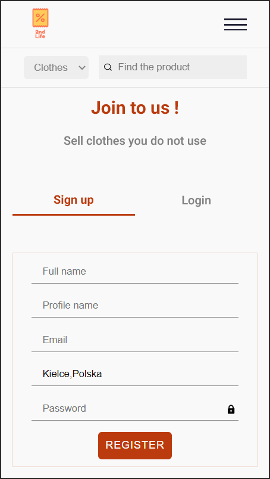
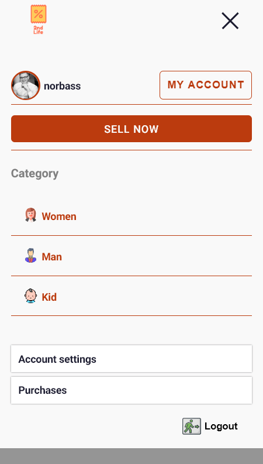
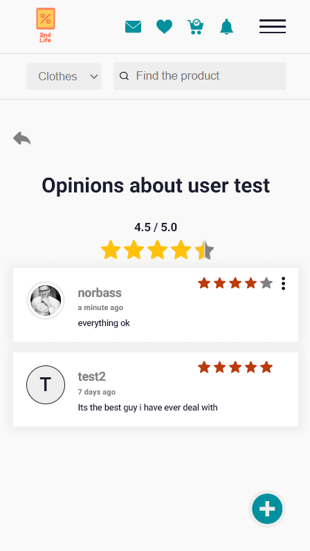
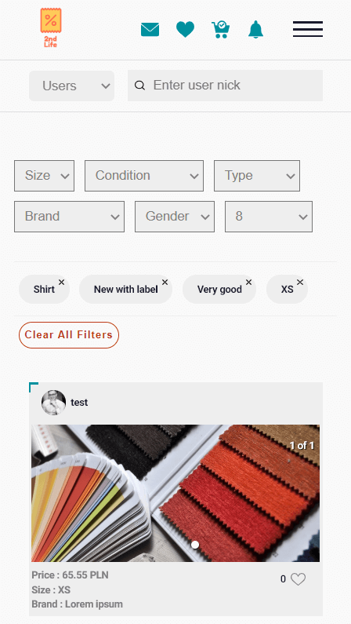
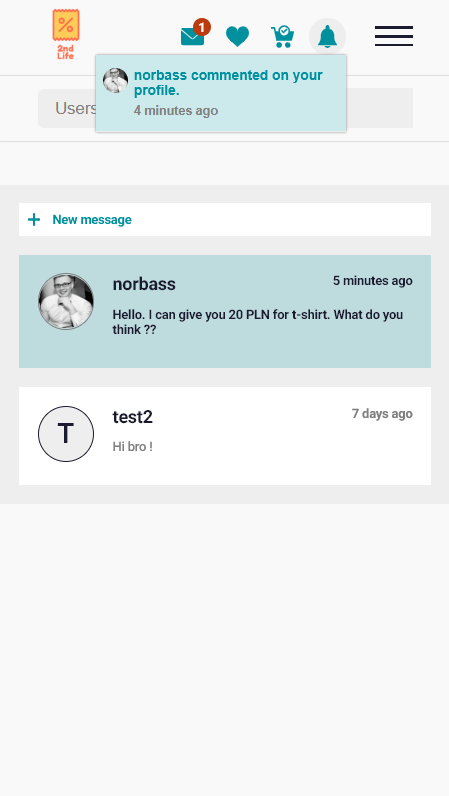
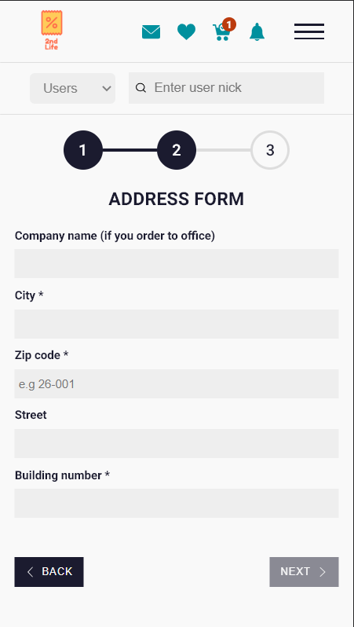

## SHORT DESCRIPTION

Second hand online shop created in MERN technologies ( mongodb, express, react, node.js ).

You are in fron-end site now. Check REST API for this application there [Back-end site](https://github.com/NorbertSan/Second-hand-online-shop-BACKEND)

Application created with mobile first design pattern (present version in only adapted for small screens) and allow to all basics functionalities which you can see on popular websites similar to this project such as :

- Sign up, sign in ( based on JWT )
- Create, remove advert
- Notifications, messages, like, add to favorite
- Filter products (URL changes without reload)
- Order a product and payment with PayPal
- Customize account information (change image,email,password,description)
- Review user (add comment with stars)
- Private and public routes
- And more ...

## Screens

## Additional

Project is still being developed :)
